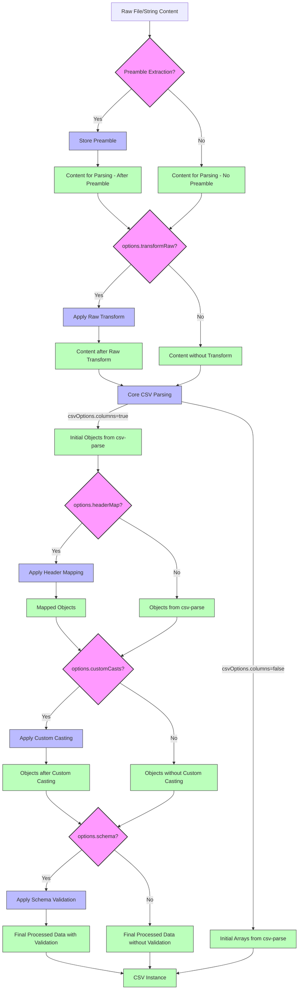

## ⚙️ How CSV Data is Processed: Order of Operations

Understanding the sequence in which configurations are applied during CSV reading (e.g., via `CSV.fromFile` or `CSV.fromString`) is key to leveraging the library's full potential. Here's a breakdown of the processing pipeline:

1.  **Input Acquisition & Preamble Extraction:**
    *   The raw CSV content is read from the file or taken from the input string.
    *   **Preamble Handling (`saveAdditionalHeader`):** If `saveAdditionalHeader` is enabled in `CSVReadOptions`, the specified initial lines (preamble) are extracted from the raw content.
        *   This preamble is parsed separately (using `additionalHeaderParseOptions` if provided) and stored in `csvInstance.additionalHeader`.
        *   The main parsing process (below) then operates on the *remaining* content, with line numbers adjusted accordingly.

2.  **Raw Content Transformation (`options.transformRaw`):**
    *   *(This option was named `transform` in the original provided code for `CSVReadOptions`, but `transformRaw` is more descriptive to differentiate from row-level transforms. Assuming `transformRaw` is intended for this stage.)*
    *   If a `transformRaw` function is provided in `CSVReadOptions`, it receives the entire (preamble-stripped, if applicable) CSV string.
    *   This allows for global modifications to the raw text *before* any CSV parsing logic is applied (e.g., fixing widespread quoting issues, removing BOMs not handled by the parser).

3.  **Core CSV Parsing (via `csv-parse` library):**
    *   The (potentially transformed) string content is fed into the underlying `csv-parse` engine, configured by `options.csvOptions`.
    *   **During this stage, `csv-parse` handles:**
        *   Recognizing delimiters, quotes, and line endings.
        *   Splitting the string into individual records (rows) and then fields (cells).
        *   **Initial Header Processing (`csvOptions.columns`):** If `columns: true` (default), the first valid line is used to determine column headers, and subsequent rows are parsed into JavaScript objects (e.g., `{ header1: 'value1', ... }`). If `columns: false`, rows are arrays.
        *   **Built-in Type Casting (`csvOptions.cast`, `csvOptions.cast_date`, etc.):** `csv-parse` can perform its own initial type conversions from strings to numbers, booleans, or dates if its casting options are enabled.

4.  **Header Mapping (`options.headerMap`):**
    *   This step applies *after* `csv-parse` has produced initial records (typically objects, if `columns: true`).
    *   If `options.headerMap` is provided:
        *   The structure of these initial objects is transformed according to the mapping rules. CSV column names (keys from `csv-parse`) are mapped to your desired object property paths (e.g., `'USER_ID'` becomes `user.id`).
        *   This includes sophisticated mappings like `CsvToArrayConfig` (merging multiple CSV columns into an array property on your objects).
    *   The output is an array of objects whose structure now more closely matches your target type `T`.

5.  **Custom Type Casting (`options.customCasts`):**
    *   Applied *after* `csv-parse` and any `headerMap` transformations. This means custom casters operate on values associated with the *final mapped property names*.
    *   For each column/property configured in `options.customCasts`:
        *   The `test` function of the caster(s) evaluates the current value (which might be a string or a type already converted by `csv-parse`).
        *   If `test` passes, the `parse` function attempts to convert it to the caster's target type.
        *   The `onCastError` option dictates behavior if a custom `parse` function fails.
    *   This allows for fine-grained control over type conversion beyond `csv-parse`'s capabilities, using your application-specific logic.

6.  **Basic Structural Validation (`options.validateData` - Deprecated/Internal):**
    *   *(Note: `validateData` was present in the provided code but seems like a more primitive validation. Modern usage would favor schema validation.)*
    *   If enabled, a basic check might be performed to ensure rows are objects (if expected) and have consistent column counts (unless `relax_column_count` is used).

7.  **Schema Validation (`options.schema`):**
    *   This is the final and most robust validation stage, occurring *after* all preceding parsing, mapping, and casting steps.
    *   The data, now hopefully closely resembling your target type `T`, is validated against:
        *   Individual column schemas (`schema.columnSchemas`).
        *   Full row schemas (`schema.rowSchema` - e.g., a Zod schema).
    *   Schemas can perform further type coercions (e.g., Zod's `z.coerce.number()`).
    *   The `validationMode` (`'error'`, `'filter'`, or `'keep'`) determines how rows failing validation are handled. If `'keep'`, `csvInstance.validationResults` will contain detailed information about validation issues.

**Visualized Flow:**

